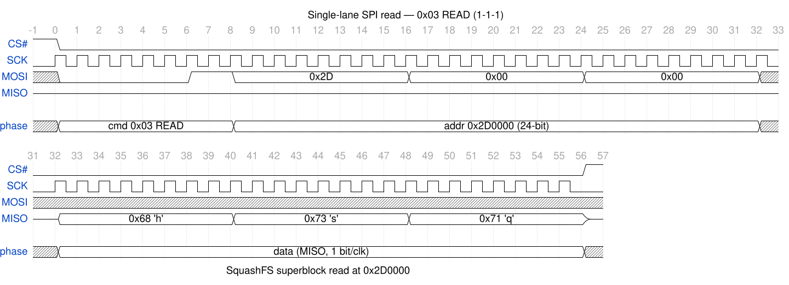
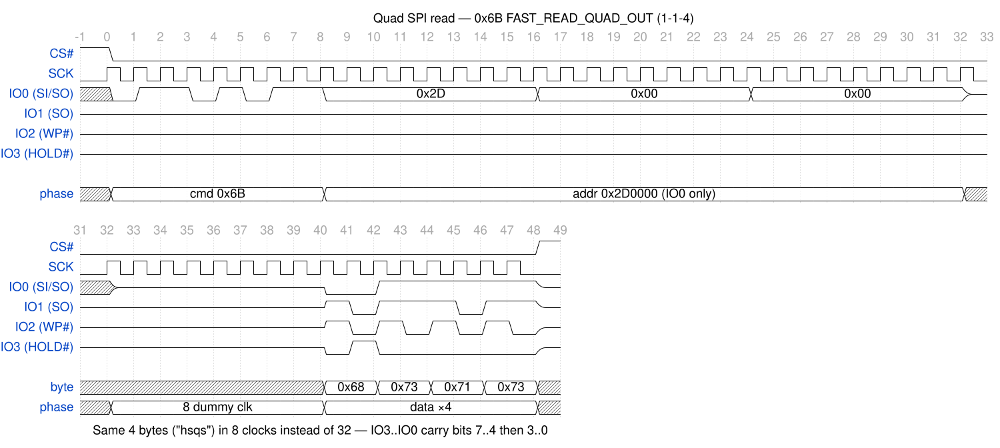

# spidump — SPI/QSPI trace capture & reconstruction

`spidump` parses logic-analyzer captures of a device reading its SPI/QSPI NOR
flash at boot and **reconstructs the flash image** from the read traffic — no
direct chip read required. The flash command set is modelled with Scapy, so a
read transaction is the same logical object whether it rode in on one wire or
four.

## Supported capture formats (auto-detected by header)

| Format | Header | Notes |
|--------|--------|-------|
| Saleae Logic 2 "SPI" analyzer table | `name,type,start_time,...,mosi,miso` | `enable`/`result`/`disable` rows, one `result` per byte |
| Saleae raw per-byte table | `Time [s],Packet ID,MOSI,MISO` | one row per byte, grouped by Packet ID |
| [QSPI-Analyzer](https://github.com/AddioElectronics/QSPI-Analyzer) export | `Time [s],Packet ID, Transaction State, DATA, Lines Used` | state machine: 1=cmd, 2=addr, 3=dummy, 4=data |

The [QSPI-Analyzer](https://github.com/AddioElectronics/QSPI-Analyzer) plugin for Saleae Logic / KingstVIS decodes quad-mode framing
(e.g. `0x6B` Fast Read Quad Output, `1-1-4`) that a plain SPI analyzer can't.

## Usage

```bash
# Standard single-lane SPI capture (Logic 2 SPI analyzer export)
python main.py examples/bigger-boot.csv -o recovered_flash.bin -v

# Quad SPI capture (QSPI-Analyzer export) — same command, format auto-detected
python main.py big-quad-spi-analyzed-dump.txt -o quad.bin -v

# Merge a single-lane leg (U-Boot) with a quad leg (rootfs) into one image.
# Devices that boot single-lane then switch to QSPI leave each region in a
# different capture; --merge splices them. Reads whose data lane width doesn't
# match the opcode (e.g. quad reads a single-lane analyzer mis-decoded) are
# dropped automatically, so a mixed capture can't poison the result.
python main.py single_lane_boot.csv --merge quad_boot.txt -o full.bin -v

# Raw exports with no chip-select framing (Packet ID constant) are split on
# idle gaps automatically (4x median byte period); override the threshold with
# --gap SECONDS, or --gap 0 to force Packet ID grouping
python main.py raw_boot.csv --gap 2e-6 -o raw.bin -v

# Force a flash size / fill byte if the auto-sizing guesses wrong
python main.py capture.txt --flash-size 0x1000000 --fill 0xFF -o out.bin
```

`-v` prints the detected format, a per-opcode transaction histogram, the chosen
flash size, and read coverage. Un-read regions are filled with `0xFF` (the
erased-NOR state), so the output is safe to feed straight into `binwalk`.

## How it works

A flash read is the same logical transaction regardless of wire width: an
opcode, an address, and a run of data bytes. The two traces below read the
same four bytes (the SquashFS magic `hsqs` at `0x2D0000`, taken from
`bigger-boot.csv`) in single-lane and quad mode:





(Regenerate with `python docs/diagrams/mkwave.py`; needs `wavedrom-cli`, and `rsvg-convert` for the PNGs.)

1. A front-end parser turns the capture into normalized read records
   `{cmd, addr, data, lines}`.
2. `SPIFlashCmd` (Scapy) models the opcode / address / dummy header; read
   opcodes (single **and** quad: `0x03 0x0B 0x6B 0xEB 0x6C 0x0C` …) are all just
   entries in `READ_COMMANDS`.
3. `reconstruct_image` replays every read into a `bytearray`, tracking coverage.

A boot only reads what it needs, so coverage is partial by design — you recover
the regions the device actually touched (bootloader, kernel, mounted rootfs).
For a device that boots single-lane then switches to quad, capture both legs and
splice them.
